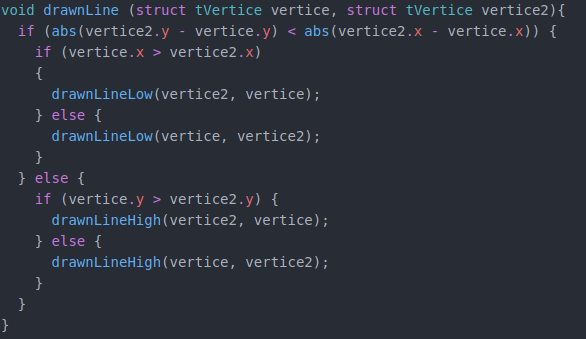

# Atividade 1

### Sobre a atividade
  Rasterizar pontos, retas e triangulos utilizando a framework passada pelo professor.

### Funções

- putPixel(): função que rasteriza um pont.

  
- drawLine(): A função drawline, feita a partir do algoritmo de Bresenham, foi dividida em duas outras funções: drawLineLow e drawLineHigh. A divisão foi feita para lidar com os octantes e rasterizar as linhas em qualquer direção. A função recebe como parametros 2 vertices do tipo tVertice, criados a partir de uma struct que possui 3 variaveis: coordenada x, coordenada y e cor.

- drawLineLow(): subparte da função drawline, como mencionado anteriormente.

- drawLineHigh(): subparte da função drawline, como mencionado anteriormente.

- Exemplo de saida: 

  
  ### Referências
  
* [Wikipedia](https://en.wikipedia.org/wiki/Bresenham%27s_line_algorithm#:~:text=Bresenham%27s%20line%20algorithm%20is%20a,straight%20line%20between%20two%20points)   ;
* Slides passado pelo professor.
