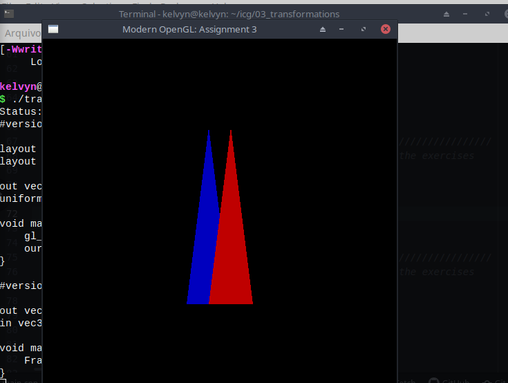

# Atividade 3

### Sobre a atividade
  O professor disponibilizou um diretorio contendo arquivos C++ a serem modificados como as questões pediam.
  A atividade consiste em nos familiarizar com o *pipeline* gráfico atraves da manipulação de figuras geométricas, nesse caso, dois triangulos.
  
### Exercício 1

