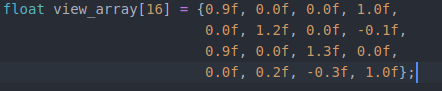

# Atividade 3

### Sobre a atividade
  O professor disponibilizou um diretorio contendo arquivos C++ a serem modificados como as questões pediam.
  A atividade consiste em nos familiarizar com o *pipeline* gráfico atraves da manipulação de figuras geométricas, nesse caso, dois triangulos.
  
### Exercício 1
A seguinte imagem e transformações foram obtidas fazendo alterações na matriz *model*:
  

  O codigo que gerou a transformação:
  
  
  

### Exercício 2
A seguinte imagem e transformações foram obtidas fazendo alterações na matriz *model*:

O codigo que gerou a transformação:

### Exercício 3
A seguinte imagem e transformações foram obtidas fazendo alterações na matriz *projection*:

O codigo que gerou a transformação:

### Exercício 4
A seguinte imagem e transformações foram obtidas mantendo a a matriz *projection* do exercício anterior e alterando a matriz *view*:

O codigo que gerou a transformação:

### Exercício 5
O ultimo exercício é uma transformação livre, alterando as três matrizes para se obter uma transformação

O codigo que gerou a transformação:

